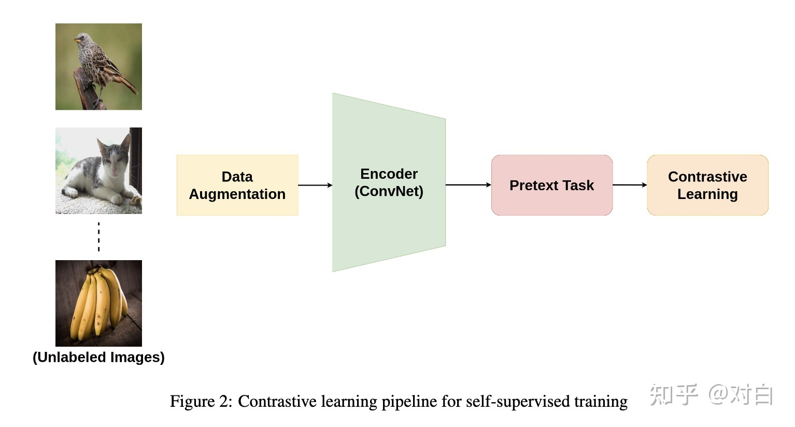
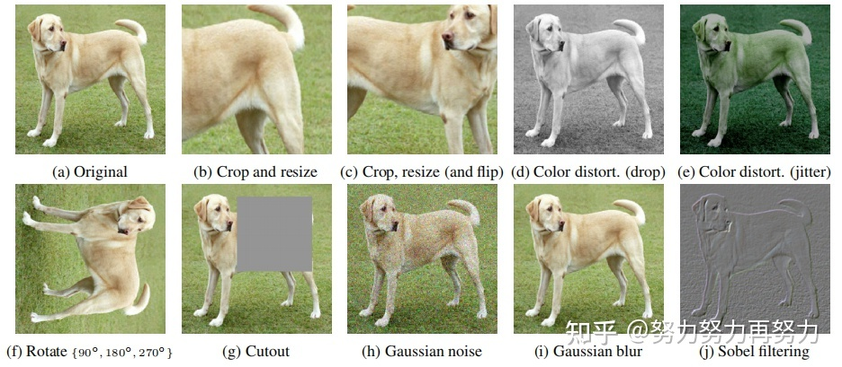

### 1 对比学习的概念
- 对比学习是一**种自监督学习**方法，用于在没有标签的情况下，**通过让模型学习哪些数据点相似或不同来学习数据集的一般特征**。
- 本质上，**对比学习**允许我们的机器学习模型做同样的事情。它会观察哪些数据点对“相似”和“不同”，以便在执行分类或分割等任务之前了解数据更高阶的特征。
- 可以在没有任何注释或标签的情况下，训练模型以学习很多关于我们的数据的知识，因此其属于自监督学习。

与生成模型不同，对比学习是一种判别模型，它让相似样本变近，不同样本变远。
为了达到这一点，一种衡量远近的指标被用来衡量嵌入之间的远近。
如图所示，对比损失用来训练对比学习模型。一般来说，以图片为例，对比学习把一张图片的增强版本当作一个正例，其余图片当作反例，然后训练一个模型来区分正反例。区分依赖于某种前置任务。

这样做，学习到的表示就可以用到下游任务之中。

### 2 前置任务
前置任务（pretext task）可以让模型从伪标签中来学习特征。例如图像修复、图像着色、拼图、超分辨率、视频帧预测、视听对应等。这些前置任务被证明可以学习到很好的表示。
在对比学习的前置任务之中，原始图片被当作一种anchor，其增强的图片被当作正样本（positive sample），然后其余的图片被当作负样本。
大多数的前置任务可以被分为四类：
- 颜色变换 --> 原图、高斯噪声、高斯模糊、颜色失真等
- 几何变换 --> 原图、裁剪、旋转、翻转等
 
- 基于上下文的任务
  - 拼图

解决一个拼图问题被当作学习表示的前置任务
原图被当作anchor，打乱后的图片被当作正样本，其余图片被当作负样本。
  - 基于帧的数据
    - 应用于时序数据，例如传感器的数据或者一系列视频帧。
      策略背后的意义是：时间上相近的相似，时间上很远的不相似。
    - 解决这样的前置任务可以让模型学习到一些跟时间有关的表示。
    - 在这里，一个视频中的帧被当作**正样本**，其余视频被当作**负样本**。
    - 其余的方法还包括：随机抽样一个长视频中的两个片段，或者对每个视频片段做几何变换。
    目标是使用对比损失（contrastive loss）来训练模型，使得来自一个视频的片段在嵌入空间中相近，来自不同视频的片段不相近。
    - 或者说**将两个正样本和其余所有的负样本之间进行对比**。
    一对正样本是两个增强的来自同一个视频的视频片段。这样，所有的视频在嵌入空间中都是分割开来的，每个视频占据一个小的嵌入空间。
- 基于交叉模式的任务

**选择什么样的前置任务取决于你所要解决的任务。**
前置任务的本质是：模型可以学习到数据本身的一些转换（数据转换之后依然被认作是原数据，转换后到数据和原数据处于同一嵌入空间），同时模型可以判别其他不同的数据样本。

**选择正确的前置任务很重要。**

基于时序数据的几篇论文：
《Time-Contrastive Networks: Self-Supervised Learning from Video》
对于视频中的每一帧，其实存在着特征相似的概念，可以认为相邻帧特征是相似的，而相隔较远的视频帧是不相似的，通过构建这种position和negative的样本来进行自监督约束。
对于同一个物体的拍摄是可能存在多个视角（multi-view），对于多个视角中的同一帧，可以认为特征是相似的，对于不同帧可以认为是不相似的。

《Unsupervised Learning of Visual Representations Using Videos》
基于无监督追踪方法，首先在大量的无标签视频中进行无监督追踪，获取大量的物体追踪框。那么对于一个物体追踪框在不同帧的特征应该是相似的，而对于不同物体的追踪框中的特征应该是不相似的。

《Shuffle and learn: unsupervised learning using temporal order verification》
基于顺序约束的方法，可以从视频中采样出正确的视频序列和不正确的视频序列，构造成正负样本对然后进行训练。简而言之，就是设计一个模型，来判断当前的视频序列是否是正确的顺序。